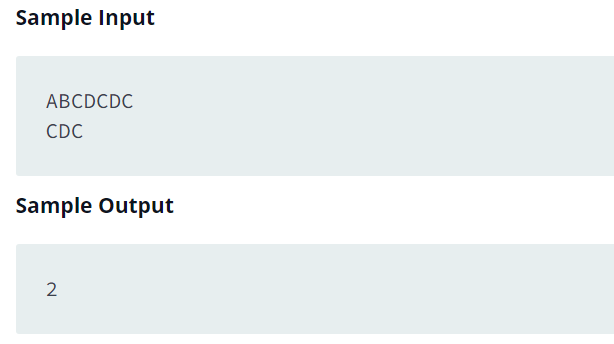

Source: https://www.hackerrank.com/challenges/find-a-string/problem?isFullScreen=false

Problem: In this challenge, the user enters a string and a substring. You have to print the number of times that the substring occurs in the given string. String traversal will take place from left to right, not from right to left.

Example: 

