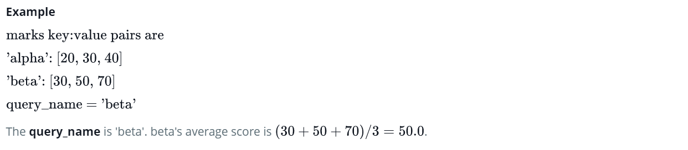

Source: https://www.hackerrank.com/challenges/finding-the-percentage/problem

Problem: The provided code stub will read in a dictionary containing key/value pairs of name:[marks] for a list of students. Print the average of the marks array for the student name provided, showing 2 places after the decimal.

Example: 

