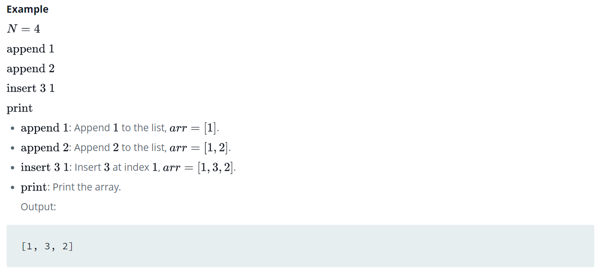

Source: https://www.hackerrank.com/challenges/python-lists/problem

Problem: Consider a list (list = []). You can perform the following commands:

1. insert i e: Insert integer e at position i.

2. print: Print the list.

3. remove e: Delete the first occurrence of integer e.

4. append e: Insert integer e at the end of the list.

5. sort: Sort the list.

6. pop: Pop the last element from the list.

7. reverse: Reverse the list.

Initialize your list and read in the value of n followed by n lines of commands where each command will be of the  types listed above. Iterate through each command in order and perform the corresponding operation on your list.

Example: 

