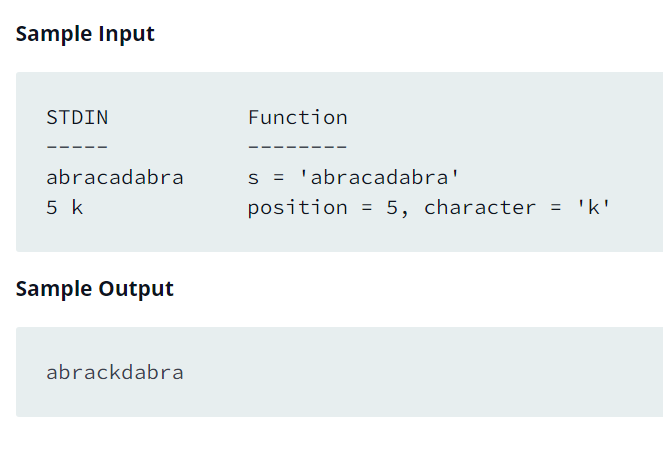

Source: https://www.hackerrank.com/challenges/python-mutations/problem?isFullScreen=false

Problem: Read a given string, change the character at a given index and then print the modified string.

Example: 

