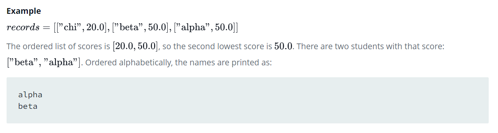

Source: https://www.hackerrank.com/challenges/nested-list/copy-from/273316977

Problem: Given the names and grades for each student in a class of  students, store them in a nested list and print the name(s) of any student(s) having the second lowest grade. If there are multiple students with the second lowest grade, order their names alphabetically and print each name on a new line.

Example: 

