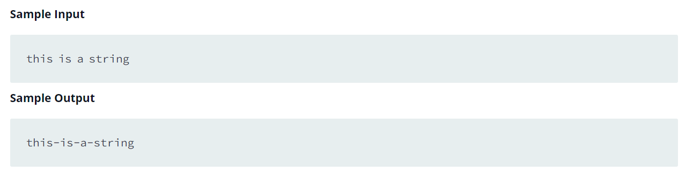

Source: https://www.hackerrank.com/challenges/python-string-split-and-join/problem?isFullScreen=false

Problem: You are given a string. Split the string on a " " (space) delimiter and join using a - hyphen.

Example: 

