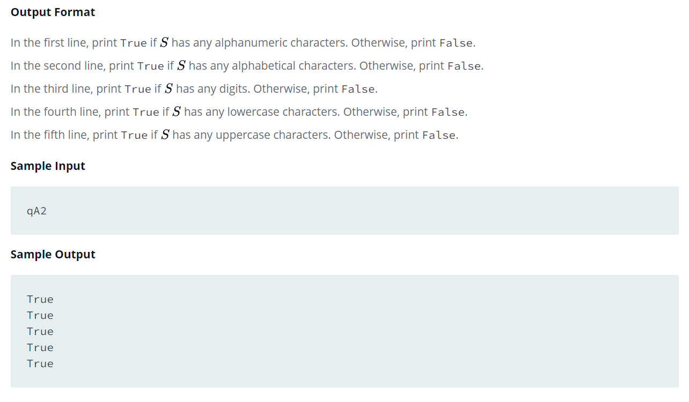

Source: https://www.hackerrank.com/challenges/string-validators/problem?isFullScreen=false

Problem: You are given a string S.
Your task is to find out if the string S contains: alphanumeric characters, alphabetical characters, digits, lowercase and uppercase characters.

Example: 

Note: https://www.w3schools.com/python/ref_func_any.asp