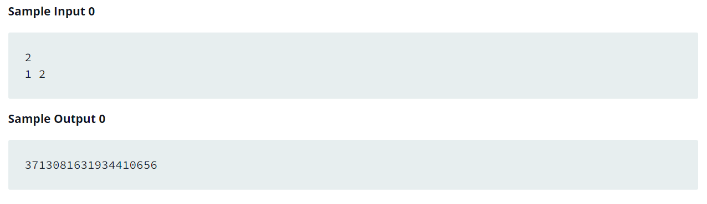

Source: https://github.com/Toshiiiii1/Python_HackerRank

Problem: Given an integer, n, and n space-separated integers as input, create a tuple, , of those  integers. Then compute and print the result of hash(t).

Example: 

https://www.programiz.com/python-programming/methods/built-in/hash