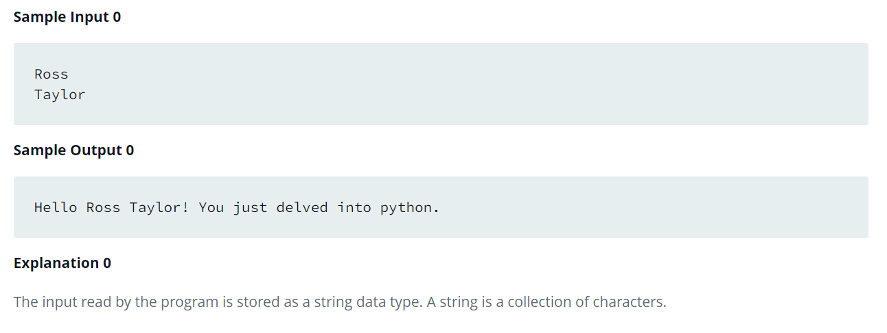

Source: https://www.hackerrank.com/challenges/whats-your-name/problem?isFullScreen=false

Problem: You are given the firstname and lastname of a person on two different lines. Your task is to read them and print the following:

    Hello firstname lastname! You just delved into python.

Example: 

