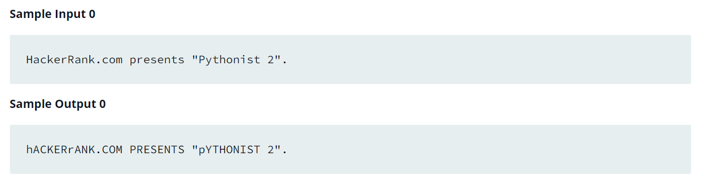

Source: https://www.hackerrank.com/challenges/swap-case/problem?isFullScreen=false

Problem: You are given a string and your task is to swap cases. In other words, convert all lowercase letters to uppercase letters and vice versa.

Example: 

